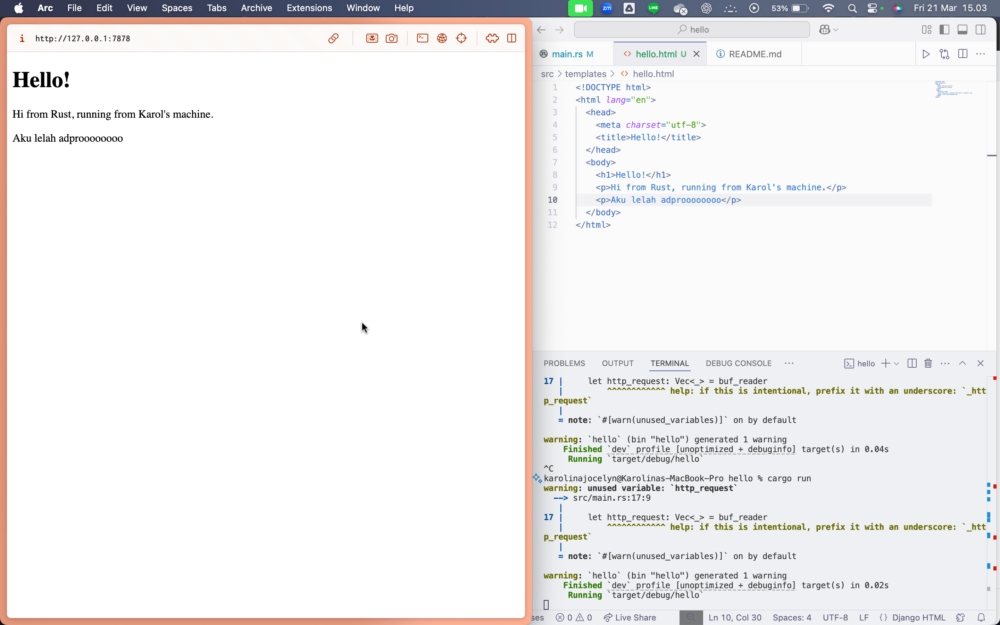
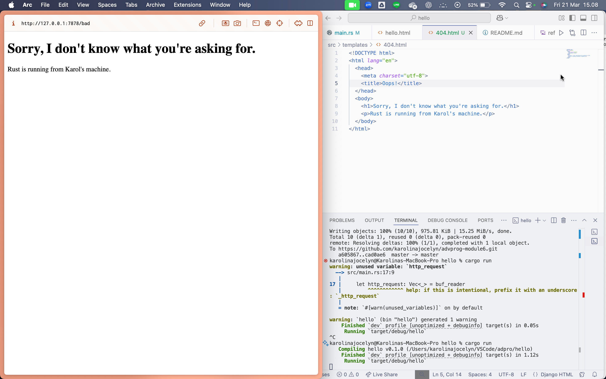

# advprog-module6

## Reflection 1

Pada tahap ini, saya membuat web server sederhana yang menerima koneksi dan membaca request HTTP menggunakan `BufReader`. Saya belajar bagaimana browser mengirim request dalam bentuk baris-baris teks, dan bagaimana Rust membaca baris-baris ini secara aman.

Rust mengajari saya tentang variabel yang tidak digunakan, yang membuat saya lebih sadar terhadap efisiensi kode. Saya juga memahami pentingnya konsep ownership di Rust, yang membuat proses seperti membaca stream lebih aman, walaupun awalnya agak membingungkan. Kode ini belum mengembalikan response ke client, tapi menjadi dasar untuk web server lebih kompleks.

## Reflection 2

Pada bagian ini, saya memodifikasi fungsi handle_connection agar web server dapat mengembalikan halaman HTML sederhana ke browser. Saya belajar bagaimana format HTTP response disusun, termasuk baris status dan header seperti Content-Length. Saya juga mengenal penggunaan fungsi fs::read_to_string untuk membaca file HTML yang dikirimkan ke client. Saya menulis kode yang eksplisit dan aman, terutama saat mengelola file dan koneksi. Saya mulai melihat bagaimana web server berinteraksi langsung dengan browser, bukan sekadar mencetak ke console. 

## Reflection 3

Pada tahap ini, saya menambahkan logika validasi request URL sehingga server bisa membedakan antara permintaan halaman yang valid dan tidak valid. Saya membuat response 404 menggunakan file HTML khusus dan memahami kapan dan bagaimana server harus mengembalikan status "Not Found". Refactoring sangat membantu agar kode lebih terstruktur, mudah dibaca, dan dipelihara, terutama saat banyak kondisi berbeda harus ditangani. Tanpa validasi ini, server tidak bisa menangani permintaan berbeda secara efisien. Melalui bagian ini, penting untuk membuat server yang tidak hanya bisa merespons, tapi juga merespons dengan tepat.

## Reflection 4

Di tahap ini, saya mensimulasikan permintaan lambat dengan menambahkan delay selama 10 detik menggunakan thread::sleep. Saya mencoba mengakses /sleep dan halaman utama secara bersamaan, dan menyadari bahwa server hanya bisa melayani satu permintaan secara berurutan (blocking). Hal ini menunjukkan keterbatasan server single-threaded, terutama jika ada banyak permintaan yang harus dilayani bersamaan. Saya jadi memahami pentingnya concurrency dan bahwa server harus mampu menangani beberapa request sekaligus untuk performa yang baik.

## Reflection 5

Di bagian ini, saya mengimplementasikan server multithreaded menggunakan ThreadPool, mengikuti panduan dari Rust Book. Saya belajar cara mendesain pool dengan sejumlah thread tetap agar server tidak membuat thread tak terbatas, yang bisa menyebabkan serangan DoS. Konsep ownership kembali penting karena ThreadPool harus meminjam tugas dan memastikan sinkronisasi thread. Dengan pendekatan ini, server saya mampu menangani beberapa request secara bersamaan, tanpa blocking. Penting juga untuk balance antara concurrency dan resource control agar server tetap efisien dan aman.